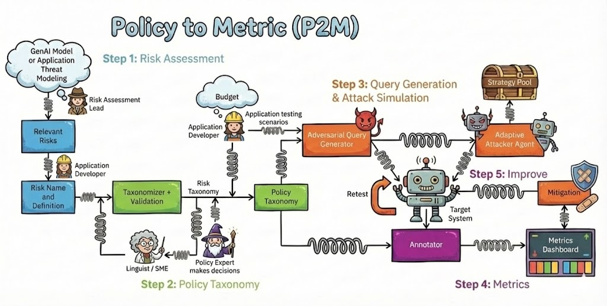

<p align="center">
  
</p>

# Adaptive Eval

**Spec-driven evaluation for AI agents - local-first, framework-agnostic, and trace-aware.**

> **Customer preview.** Adaptive Eval is a preview / POC for design-partner and GBB engagements. The core workflow is stable: write an eval spec, generate targeted test cases, execute them against your agent, and judge the results against your rubric. Some YAML field names are still evolving; the docs bridge current names to the intended developer-facing terminology.

## Why Adaptive Eval

Most eval tools start with a fixed benchmark. Real agents fail in product-specific ways: they call the wrong tool, ignore a constraint, fabricate a price, skip a safety check, or agree with a risky plan.

Adaptive Eval flips the workflow. **You write a short spec describing what your agent should and should not do.** The pipeline derives behavior categories, generates single-turn and multi-turn test cases, executes them against your target, and uses an LLM judge to score each conversation against your spec. When your agent emits OpenTelemetry spans, the judge can inspect the execution trace too: tool calls, arguments, routing, latency, and intermediate decisions.

You get:

- **Spec-driven coverage** - test cases are generated from your product requirements, not a generic benchmark.
- **Framework-agnostic targets** - evaluate a LangGraph agent, a Python callable, or a hosted model without rewriting the eval pipeline.
- **Trace-grounded judgment** - when your agent emits OpenTelemetry spans, use Phoenix/OpenInference to capture real agent behavior beyond the final response.
- **Portable artifacts** - every stage writes JSON/JSONL files locally for inspection, CI, and sharing.

## Quickstart: LangGraph travel planner with trace capture

The flagship example evaluates a multi-tool LangGraph travel planner. The target is reached through `target.callable`, and Phoenix/OpenInference auto-instrumentation captures the agent's LangChain/LangGraph/OpenAI spans. You do not need to understand OpenTelemetry to start; the example wires it up for you.

Recommended install path for preview customers:

```bash
python -m venv .venv
source .venv/bin/activate
python -m pip install --upgrade pip
python -m pip install -e ".[otel,langgraph]"
cp .env.example .env
# Edit .env with AZURE_API_KEY, AZURE_API_BASE, and any model deployment settings.

# Optional: run Phoenix locally if you want to browse traces.
phoenix serve

# Run the full pipeline: spec -> taxonomy -> test cases -> execution -> verdicts.
p2m run --config examples/travel_planner_langgraph/eval_config.yaml

# Inspect the run.
p2m results status travel-planner-langgraph-v1 demo-1
```

Windows PowerShell equivalent:

```powershell
python -m venv .venv
.\.venv\Scripts\Activate.ps1
python -m pip install --upgrade pip
python -m pip install -e ".[otel,langgraph]"
Copy-Item .env.example .env

phoenix serve
p2m run --config examples/travel_planner_langgraph/eval_config.yaml
p2m results status travel-planner-langgraph-v1 demo-1
```

### macOS install note

Use the `pip install -e ".[otel,langgraph]"` path above as the primary preview install path on macOS.

We have seen macOS security tooling silently block `uv sync` from extracting several large files from the `litellm` wheel. When that happens, Python imports `litellm` as an empty namespace package and later fails with errors such as `AttributeError: module 'litellm' has no attribute 'acompletion'`. `pip` uses a copy-based install path and avoids this issue.

If you still prefer `uv`, and `litellm` imports without expected attributes, try granting your terminal Full Disk Access and clearing quarantine attributes on the environment:

```bash
xattr -cr .venv
```

What the quickstart does:

| Step | Developer concept | Current YAML / artifact |
|---|---|---|
| 1 | **Eval spec**: plain-English behavior requirements | `concept.name: travel_planner_eval` loads `examples/travel_planner_langgraph/travel_planner_eval.md` |
| 2 | **Behavior categories**: generated failure-mode taxonomy | `pipeline.policy` writes `policy.json` |
| 3 | **Test cases**: prompts and multi-turn scenarios | `pipeline.seeds` writes `seeds.jsonl` |
| 4 | **Execute**: run the agent and capture traces | `pipeline.rollout.target.callable` + optional `target.trace` write `transcripts.jsonl` |
| 5 | **Judge**: score against your rubric | `pipeline.judge.dimensions` writes `scores.jsonl` and `metrics.json` |

Start with the full walkthrough: [`docs/quickstart.md`](docs/quickstart.md).

## How it works

```text
your eval spec (.md)
        |
        v
behavior categories  ->  test cases + variations  ->  execute target  ->  judge
        |                         |                         |              |
        v                         v                         v              v
   policy.json                seeds.jsonl          transcripts.jsonl   scores.jsonl
                                                     + OTel traces     metrics.json
```

Today the YAML still uses implementation names such as `concept`, `factors`, `policy`, `seeds`, and `rollout`. The docs use the developer-facing concepts - spec, variations, test cases, execute, judge - and call out the current YAML key the first time each concept appears. See [`docs/glossary.md`](docs/glossary.md).

## Choose your target

Pick a target based on how your agent is built.

| Your target looks like... | Use this path | Trace fidelity | Start here |
|---|---|---|---|
| A framework agent, such as LangGraph, OpenAI Agents SDK, CrewAI, LlamaIndex, AutoGen / MAF, or DSPy | **OTel agent target**: add Phoenix/OpenInference instrumentation and point `target.callable` at your entry function | Best available visibility: tool calls, arguments, routing, model calls, latency when the framework emits spans | [`docs/targets/otel-agent.md`](docs/targets/otel-agent.md) |
| A custom runtime, multi-framework agent, or bespoke orchestration layer | **Custom trace + callable target**: expose a callable entrypoint and emit OpenTelemetry spans around the important steps | Custom visibility into your tools, routing decisions, dynamic DAG, and framework internals | [`docs/targets/otel-agent.md`](docs/targets/otel-agent.md) |
| A Python function that accepts a user message and returns a string or model response | **Callable target**: `target.callable: package.module:function` | Inputs/outputs, plus structured tool/model metadata if your callable returns it | [`docs/targets/callable.md`](docs/targets/callable.md) |
| A hosted model with a system prompt, optionally with tools | **Model + tools target**: `target.model`, `target.system_prompt`, and optional `target.tools` | Conversation transcript and tool traces for simple prompt-agent setups | [`docs/targets/model-and-tools.md`](docs/targets/model-and-tools.md) |

**Recommended for best eval results:** use trace capture when your agent has meaningful internals. Otherwise, the judge is mostly evaluating final text and may miss tool calls, routing decisions, dynamic DAG behavior, and framework internals.

**New to OpenTelemetry?** You can still use Adaptive Eval. Start with the callable or model target. Add trace capture when you need to debug why an agent produced an answer, not just what answer it produced.

**Use simulated tools intentionally:** simulated tools are helpful for prompt agents when real backends are not ready. They are not a substitute for tracing a real multi-agent framework.

## Examples

| Example | What it shows | Best for |
|---|---|---|
| [`examples/travel_planner_langgraph`](examples/travel_planner_langgraph/) | Full pipeline with `target.callable`, Phoenix OTel trace capture, generated test cases, and judge dimensions for quality + safety | Start here for framework agents |
| [`examples/phoenix_auto_trace`](examples/phoenix_auto_trace/) | The same travel-planner idea across 33 framework instrumentation paths | Understanding framework breadth |
| [`examples/pipes/health_assistant.yaml`](examples/pipes/health_assistant.yaml) | Simple hosted model target with a system prompt | Quick smoke test for a single model |
| [`examples/pipes/health_assistant_simulated_tools.yaml`](examples/pipes/health_assistant_simulated_tools.yaml) | Hosted model with simulated tool responses from a fixed schema | Prompt agents with planned tools but no backend yet |

See [`examples/README.md`](examples/README.md).

## Artifacts

Every run writes a self-contained directory under `artifacts/results/<suite>/<run>/`:

```text
artifacts/results/<suite>/
├── suite.json
├── policy.json
├── seeds.jsonl
└── <run>/
    ├── manifest.json
    ├── config.yaml
    ├── transcripts.jsonl
    ├── scores.jsonl
    └── metrics.json
```

These artifacts are portable and inspectable:

- `policy.json` - generated behavior taxonomy from your spec.
- `seeds.jsonl` - generated prompts and scenarios.
- `transcripts.jsonl` - target conversations and trace references.
- `scores.jsonl` - per-conversation verdicts with reasoning and evidence.
- `metrics.json` - aggregate rates by judge dimension and behavior category.

Browse them with the CLI, the local viewer, or any JSONL tool. Nothing leaves your machine unless you send it somewhere.

## Documentation map

- **Get started:** [`docs/quickstart.md`](docs/quickstart.md), [`docs/concepts.md`](docs/concepts.md), [`docs/glossary.md`](docs/glossary.md)
- **Targets:** [`docs/targets/overview.md`](docs/targets/overview.md), [`docs/targets/otel-agent.md`](docs/targets/otel-agent.md), [`docs/targets/callable.md`](docs/targets/callable.md), [`docs/targets/model-and-tools.md`](docs/targets/model-and-tools.md)
- **Authoring:** [`docs/writing-eval-specs.md`](docs/writing-eval-specs.md), [`docs/reading-results.md`](docs/reading-results.md)
- **Reference:** [`docs/reference/cli.md`](docs/reference/cli.md), [`CONFIG_REFERENCE.md`](CONFIG_REFERENCE.md)
- **AI assistants:** [`AGENTS.md`](AGENTS.md), [`docs/ai-agent-onboarding.md`](docs/ai-agent-onboarding.md)
- **Preview operations:** [`docs/private-preview/access-and-repo-workflow.md`](docs/private-preview/access-and-repo-workflow.md), [`docs/status-and-roadmap.md`](docs/status-and-roadmap.md)

## Status

Adaptive Eval is a customer preview / POC, not a GA service.

Stable enough to try:

- spec -> behavior categories -> test cases -> execute -> judge workflow
- local artifact layout
- `target.callable`
- OTel trace capture through Phoenix/OpenInference for supported frameworks
- hosted model and model+tools targets

Still evolving:

- public terminology and YAML aliases
- hosted/cloud integration story
- framework-specific quickstarts beyond the current examples

Preview feedback is welcome: confusing names, missing target examples, trace gaps, judge behavior, artifact shape, and docs clarity are all useful signals.
